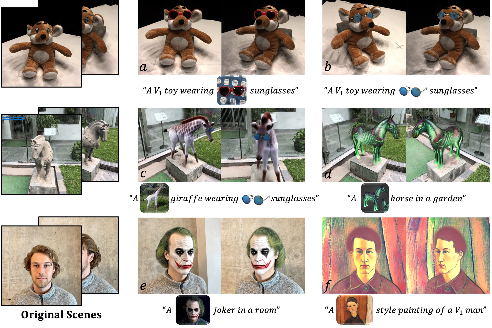
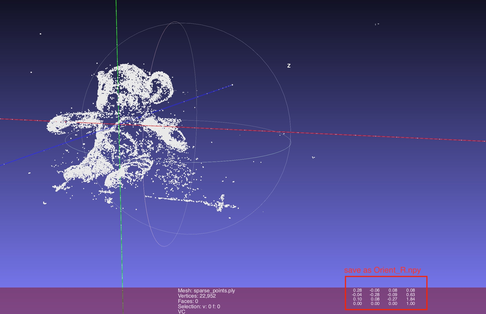
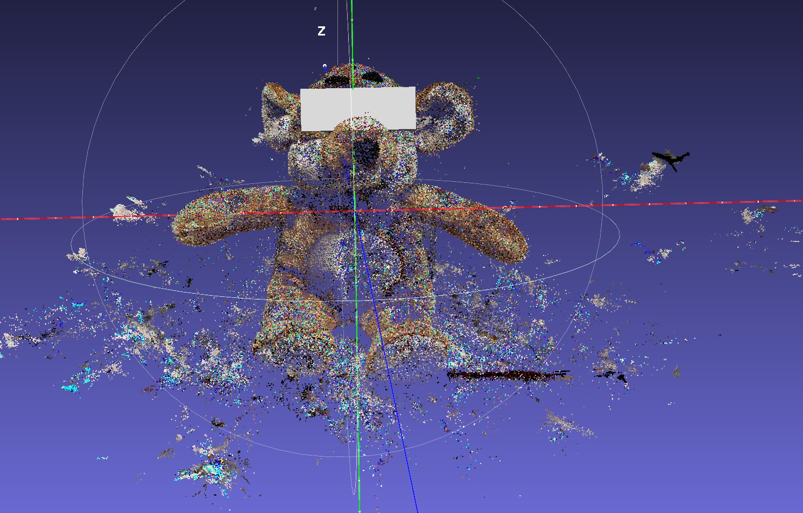

# TIP-Editor: An Accurate 3D Editor Following Both Text-Prompts And Image-Prompts (SIGGRAPH 2024 & TOG)

<div class="half">
    
</div>


### [Project page](https://zjy526223908.github.io/TIP-Editor/) |[Paper](https://arxiv.org/abs/2401.14828) |[Initial 3D-GS](https://drive.google.com/drive/folders/1DWcMyx5ab7PW3QkCwtJmkKUBL_feQxNW?usp=sharing) | [Edited 3D-GS](https://drive.google.com/drive/folders/1Tv2bwfznzqEMX3qOBrWeIQWYR0kg0JA7?usp=drive_link) 


## Todo 
- [x] **Release training code of step 1,2,3**
- [ ] Release all editing samples reported in the paper


## Dependencies
Install with pip:
```
    pip install torch==1.12.1+cu116 torchvision==0.13.1+cu116 torchaudio===0.12.1+cu116
    pip install git+https://github.com/NVlabs/tiny-cuda-nn/#subdirectory=bindings/torch
    pip install diffusers==0.22.0.dev0
    pip install huggingface_hub==0.16.4
    pip install open3d==0.17.0 trimesh==3.22.5 pymeshlab
    
    # install gaussian rasterization
    git clone --recursive https://github.com/ashawkey/diff-gaussian-rasterization
    pip install ./diff-gaussian-rasterization
    
    # install simple-knn
    git clone https://github.com/camenduru/simple-knn.git
    pip install ./simple-knn
```


Training requirements
- [Stable Diffusion](https://huggingface.co/models?other=stable-diffusion). We use diffusion prior from a pretrained 2D Stable Diffusion 2.0 model. To start with, you may need a huggingface [token](https://huggingface.co/settings/tokens) to access the model, or use `huggingface-cli login` command.

## Data process
Run COLMAP to estimate camera parameters.
Our COLMAP loaders expect the following dataset structure in the source path location:
```
<./data/filename>
|---images
|   |---<image 0>
|   |---<image 1>
|   |---...
|---sparse
    |---0
        |---cameras.bin
        |---images.bin
        |---points3D.bin
```

Extract sparse points
```
    python colmap_preprocess/extract_points.py ./data/filename/
```


Align the scene with coordinate system. Get Orient_R.npy.

We use meshlab to align the scene with coordinate system. Click Filters->Normals,Curvatures and Orientation->Matrix: Set from translation\rotation\scale. 
Make sure the Y-axis is vertical and upward to the ground, and the object is oriented in the same direction as the z-axis.
<div class="half">
    
</div>

## Training 
Download [Initial 3D-GS](https://drive.google.com/drive/folders/1DWcMyx5ab7PW3QkCwtJmkKUBL_feQxNW?usp=sharing)

Download editing scene images in the paper from [Data](https://drive.google.com/drive/folders/1sHCyZ9E0Y5L5Qfjdh_Oo7FCT9evJmrXj?usp=drive_link)

### How to set 3D bounding box?

Users can extract the colored points of the scene from the trained 3D-GS for visualization as following:
```
    python save_scene_points.py --pth_path  .../xx.pth
```
Then Users can add a cube to the sparse points scene through meshlab or blender, 
scale and drag it to the desired position, and save it in .ply format. 

<div class="half">
    
</div>


### Start training
```
    bash run_doll_sunglasses1.sh
```


## Testing
Download [Edited 3D-GS](https://drive.google.com/drive/folders/1Tv2bwfznzqEMX3qOBrWeIQWYR0kg0JA7?usp=drive_link)  and unzip in res file
```
   bash test.sh
```


## Citation
If you find this code helpful for your research, please cite:
```
@inproceedings{zhuang2023dreameditor,
  title={Dreameditor: Text-driven 3d scene editing with neural fields},
  author={Zhuang, Jingyu and Wang, Chen and Lin, Liang and Liu, Lingjie and Li, Guanbin},
  booktitle={SIGGRAPH Asia 2023 Conference Papers},
  pages={1--10},
  year={2023}
}
@article{zhuang2024tip,
  title={TIP-Editor: An Accurate 3D Editor Following Both Text-Prompts And Image-Prompts},
  author={Zhuang, Jingyu and Kang, Di and Cao, Yan-Pei and Li, Guanbin and Lin, Liang and Shan, Ying},
  journal={arXiv preprint arXiv:2401.14828},
  year={2024}
}
```

## Acknowledgments
This code based on [3D-GS](https://github.com/graphdeco-inria/gaussian-splatting),[Stable-Dreamfusion](https://github.com/ashawkey/stable-dreamfusion), [Dreambooth](https://huggingface.co/docs/diffusers/training/dreambooth), [DAAM](https://github.com/castorini/daam). 

